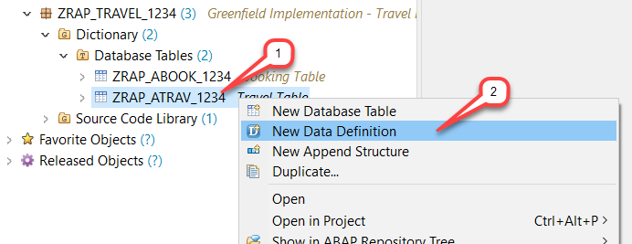
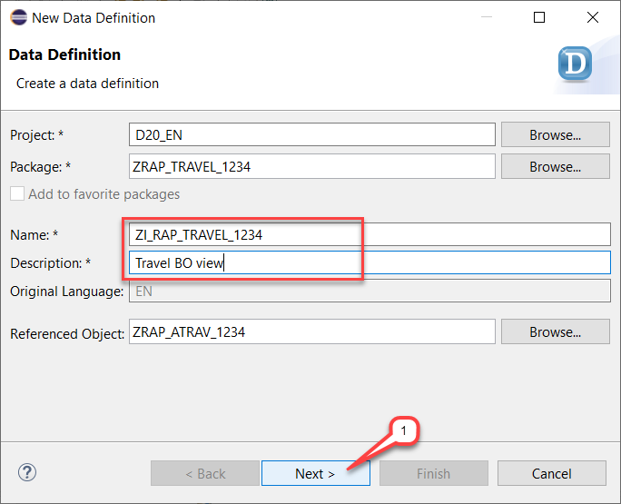
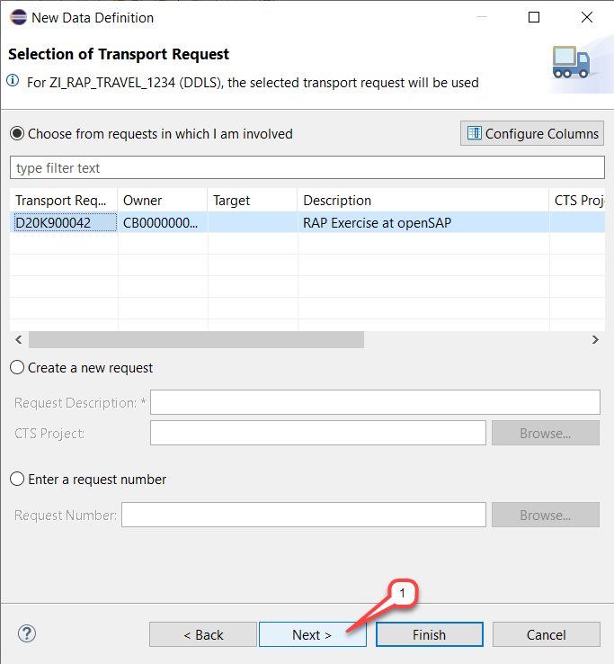
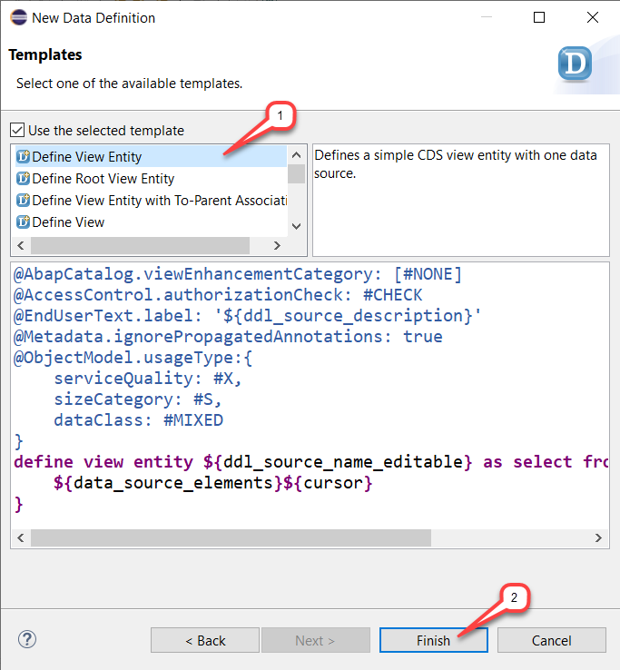
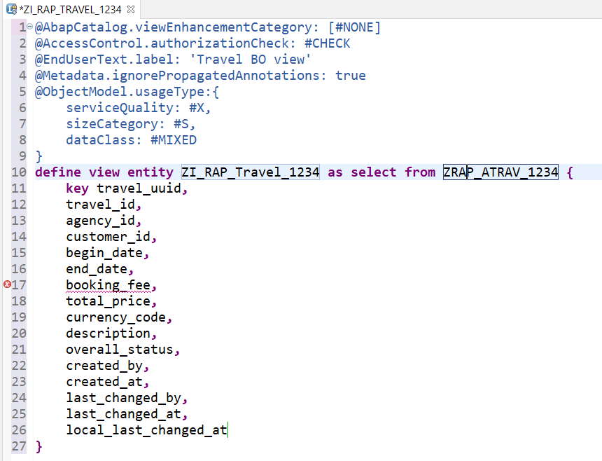
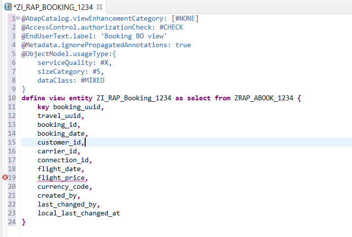

# HANDS-ON EXERCISE FOR EXERCISE 2 UNIT 2: CREATING THE CORE DATA SERVICES CDS) DATA MODEL

## Previous exercise:  
[Exercise 2 Unit 1: Creating the Database Tables](unit1.md)

## Introduction  
In the present hands-on exercise, you will define the travel and the booking interface views (aka BO views) of the CDS data model for your travel app. As preparation step for exercise 2, we will directly define the business object structure - i.e. the composition tree – in this exercise.    

> **Hints and Tips**    
> Speed up the typing by making use of the Code Completion feature (shortcut *Ctrl+Space*) and the prepared code snippets provided. 
> You can easily open an object with the shortcut *Ctrl+Shift+A*, format your source code using the Pretty Printer feature *Shift+F1* and toggle the fullscreen of the editor using the shortcut *Ctrl+M*.   
>
> A great overview of ADT shortcuts can be found here: [Useful ADT Shortcuts](https://blogs.sap.com/2013/11/21/useful-keyboard-shortcuts-for-abap-in-eclipse/)
>
> Please note that the placeholder **`####`** used in object names in the exercise description must be replaced with the suffix of your choice during the exercises. The suffix can contain a maximum of 4 characters (numbers and letters).
> The screenshots in this document have been taken with the suffix `1234` and system `D20`. Your system id will be `TRL`.

> Please note that the ADT dialogs and views may change in the future due to software updates.

Follow the instructions below.
    
## Step 1.	Create the Interface CDS View for the Travel Entity
First, create the Interface CDS view **`ZI_RAP_Travel_####`** (where `####` is your chosen suffix)  for the Travel entity. 
1. Right-click on your travel table **`ZRAP_ATRAV_####`** and choose **New Data Definition** from the context menu.

 

2.  Maintain **` ZI_RAP_Travel_####`** as name and a meaningful description (e.g. _**Travel BO view**_) in the creation wizard and choose **Next** to continue.  
The project, the package and the referenced object have been automatically assigned.
    >**Please note**    
    >In this course, we will follow the naming convention of the Virtual Data Model (VDM) of the SAP S/4HANA where the name of interface or BO views begins with _`<namespace>I`_ (e.g _`ZI_`_) and the name of consumption or projection views begins with the namespace followed by _`<namespace>C`_ (e.g. _`ZC_`_).
     
    

3. Assign a transport request and choose **Next**. 

    
  
4. Choose the **Define View entity** template from the list of Data Definition templates provided for your convenience and then choose **Finish**.
    
    > **Excursus:**    
    > One of the main differences between CDS DDIC-based view and CDS view entity, is that the latter does not have an associated SQL view, and the name of the Data Definition object in the Project Explorer and the name of the CDS entity specified after the keyword `DEFINE VIEW ENTITY` are identical. This makes the lifecycle of CDS View entities way easier.
    
    

    The new data definition appears in the appropriate editor.

    

    **Short Explanation:**    
    The travel table `ZRAP_ATRAV_1234` is used as data source and the table fields have been automatically inserted in the projection list between the curly brackets `{}` – except the client field which is handled implicitly by the platform because the view is client specific. The view key element is specified with the keyword **`key`**.

5. Replace the code of the travel data definition in the editor with the code snippet provided below and replace all occurrences of  `####` with your chosen suffix. 
   You can make use of the _Replace All_ feature (**Ctrl+F**) in ADT for the purpose.  

   Save  the changes, but **DO NOT** activate the travel interface view yet.

    <pre>
    @AccessControl.authorizationCheck: #CHECK
    @EndUserText.label: 'Travel BO view'
    define view entity ZI_RAP_Travel_####
      as select from zrap_atrav_#### as Travel

      association [0..*] to ZI_RAP_Booking_#### as _Booking on $projection.TravelUUID = _Booking.TravelUUID
      
      association [0..1] to /DMO/I_Agency       as _Agency   on $projection.AgencyID = _Agency.AgencyID
      association [0..1] to /DMO/I_Customer     as _Customer on $projection.CustomerID = _Customer.CustomerID
      association [0..1] to I_Currency          as _Currency on $projection.CurrencyCode = _Currency.Currency  
    {
      key travel_uuid           as TravelUUID,
          travel_id             as TravelID,
          agency_id             as AgencyID,
          customer_id           as CustomerID,
          begin_date            as BeginDate,
          end_date              as EndDate,
          @Semantics.amount.currencyCode: 'CurrencyCode'
          booking_fee           as BookingFee,
          @Semantics.amount.currencyCode: 'CurrencyCode'
          total_price           as TotalPrice,
          currency_code         as CurrencyCode,
          description           as Description,
          overall_status        as TravelStatus,
          @Semantics.user.createdBy: true
          created_by            as CreatedBy,
          @Semantics.systemDateTime.createdAt: true
          created_at            as CreatedAt,
          @Semantics.user.lastChangedBy: true
          last_changed_by       as LastChangedBy,
          @Semantics.systemDateTime.lastChangedAt: true
          last_changed_at       as LastChangedAt,
          @Semantics.systemDateTime.localInstanceLastChangedAt: true
          local_last_changed_at as LocalLastChangedAt,

          /* associations */
          _Booking,
          _Agency,
          _Customer,
          _Currency      
    }
    </pre>

    The travel data definition should look as follows.

    

    **Short explanation: What has changed?**      
    - Following view annotations, specified at the top of the data definition template, have been removed, because they are not relevant for our scenario:
        <pre> 
        @AbapCatalog.viewEnhancementCategory: [#NONE]  
        @Metadata.ignorePropagatedAnnotations: true  
        @ObjectModel.usageType:{
            serviceQuality: #X,
            sizeCategory: #S,
            dataClass: #MIXED
        }
        </pre>             
    - The alias **`Travel`**  is now specified for the data source using the keyword **`as`**.
    - Associations are defined for the entities Booking (**`_Booking`**), Agency (**`_Agency`**), Customer (**`_Customer`**) and Currency (**`_Currency`**) – and exposed in the projection list.
    An error is currently displayed by the association **`_Booking`**, because the specified Booking BO view **`ZI_RAP_Booking_####`** does not yet exist. You will create it in the next step.
    - A CamelCase alias has been specified for each view elements using the keyword **`as`**.    
      PS: The alias **`TravelStatus`**  is used for the view element **`Overall_Status`**.
    - To ensure uniform data processing on the consumer side, **`@Semantics`** annotations are used to enrich some of the fields – i.e. the currency fields and the administrative fields in the present scenario.   
    The currency key field **`CurrencyCode`** is specified as the reference field of the currency fields **`BookingFee`** and **`TotalPrice`** using the annotation **`@Semantics.amount.currencyCode`**.     
    The annotation of the administrative data is a preparation step for exercise 2, where the transactional behavior of the Travel List Report app will be enabled. These annotations are required to allow the automatic update of the fields on every operation.
                
>**Note:** DO NOT yet activate the CDS data definition as you are not yet done with the definition of the Travel interface view. The BO structure is not yet defined. **This will be done in step 4**.

## Step 2.	Create the Interface CDS View for the Booking entity
Now, you will create the Interface CDS view **`ZI_RAP_Booking_####`** (where #### is your chosen suffix) for the Booking entity.
1. Right-click on your booking table **`ZRAP_ABOOK_####`** and choose **New Data Definition** from the context menu.

    

2.  Maintain **`ZI_RAP_Booking_####`** as name and a meaningful description (e.g. _**Booking BO view**_) in the creation wizard and choose **Next** to continue.  
   The project, the package and the referenced object have been automatically assigned.  
 
    

3. Assign a transport request and choose **Next**. 
 
    

4. Choose the Define View entity template from the list and then choose **Finish**.
The new data definition appears in the editor. You can make use of the Source Code Formatter (**SHIFT+1**) to format the source code.
 
    

    The booking data definition should look as follows.
 
    

5. Replace the booking data definition in the editor with the code snippet provided below and replace all occurrences of  `####` with your chosen suffix. You can make use of the _Replace All_ feature (**Ctrl+F**) in ADT for the purpose.  
    
    Save the changes, but **DO NOT** activate the booking interface view yet. 

    <pre>
    @AccessControl.authorizationCheck: #CHECK
    @EndUserText.label: 'Booking BO view'
    define view entity ZI_RAP_Booking_####
      as select from zrap_abook_#### as Booking

      association [1..1] to ZI_RAP_Travel_####        as _Travel     on  $projection.TravelUUID = _Travel.TravelUUID
      
      association [1..1] to /DMO/I_Customer           as _Customer   on  $projection.CustomerID   = _Customer.CustomerID
      association [1..1] to /DMO/I_Carrier            as _Carrier    on  $projection.CarrierID    = _Carrier.AirlineID
      association [1..1] to /DMO/I_Connection         as _Connection on  $projection.CarrierID    = _Connection.AirlineID
                                                                     and $projection.ConnectionID = _Connection.ConnectionID
      association [1..1] to /DMO/I_Flight             as _Flight     on  $projection.CarrierID    = _Flight.AirlineID
                                                                     and $projection.ConnectionID = _Flight.ConnectionID
                                                                     and $projection.FlightDate   = _Flight.FlightDate
      association [0..1] to I_Currency                as _Currency   on $projection.CurrencyCode    = _Currency.Currency    
    {
      key booking_uuid          as BookingUUID,
          travel_uuid           as TravelUUID,
          booking_id            as BookingID,
          booking_date          as BookingDate,
          customer_id           as CustomerID,
          carrier_id            as CarrierID,
          connection_id         as ConnectionID,
          flight_date           as FlightDate,
          @Semantics.amount.currencyCode: 'CurrencyCode'
          flight_price          as FlightPrice,
          currency_code         as CurrencyCode,
          @Semantics.user.createdBy: true
          created_by            as CreatedBy,
          @Semantics.user.lastChangedBy: true
          last_changed_by       as LastChangedBy,
          @Semantics.systemDateTime.localInstanceLastChangedAt: true
          local_last_changed_at as LocalLastChangedAt,

          /* associations */
          _Travel,
          _Customer,
          _Carrier,
          _Connection,
          _Flight,
          _Currency
    }
    </pre>

    The booking data definition should look as follows.

    

    The view columns have now aliases, the associations to the entities Travel, Customer, Carrier, Flight and Currency are specified – and added to the projection list.
    @Semantics annotations are also specified for the currency field XXXX and the administrative fields.

    >**Note:** You are not yet through with the definition of the Booking interface view, because the BO structure is not yet defined. You will do it in step 4 of this exercise.

## Step 3.	Activate the CDS Data Model & Preview the Data 
To avoid an error during the activation, both new CDS views – i.e. the Travel interface view and the Booking interface view – must be activated together for the first time.  

1.	Choose **Activate All**  or use the shortcut **Ctrl+Shift+F3**.    
    Select both CDS views **`ZI_RAP_TRAVEL_####`** and **`ZI_RAP_BOOKING_####`** on the appearing dialog, and choose **Activate**.
 
    

    Both CDS views are now activated, but warnings are displayed in the _Problems_ view and in the editor. The reason behind this is that the authority check is allowed for these CDS views (`@AccessControl.authorizationCheck: #CHECK`), but no CDS access control is currently defined for them. You will work on this in unit 6 of exercise 1 where you will define a basic CDS access control.
 
     

2.	To run the Data Preview, choose the relevant CDS data definition – i.e. **`ZI_RAP_TRAVEL_####`** or **`ZI_RAP_BOOKING_####`** where `####`is your chosen suffix – in the Project Explorer (or open it in the editor) and press **F8**.  
  
     The Data Preview will open in the editor area.  
 
    

## Step 4.	Define the Composition Model
Finally, you will now enhance the CDS data model to specify the business object structure: The composition model (or composition tree). 
As already mentioned in the introduction of this unit, this step is not mandatory when building read-only application. It is only a preparation for the hands-on exercises of exercise 2 where you’re are going to enable the transactional behavior of your Travel App. Nevertheless, this is a typical step when defining your CDS data model since read-only and transactional apps can be built on top of the same data model.  
Our composition model consists of two nodes: The root node travel and its child node booking.

1.	Open the CDS data definition **`ZI_RAP_TRAVEL_####`** (where `####` is your chosen suffix) and add the keyword **`root`**  in the **`define view entity`** statement to change it as follows:
    <pre>
      define root view entity ZI_RAP_Travel_####
    </pre>

2.	Adjust the definition of the **`_Booking`** association to a composition which is needed to define the relationship from a parent node (travel) to a child node (booking). 
For that, replace the definition of the association **`_Booking`** with the following composition definition:  
    <pre>
       composition [0..*] of ZI_RAP_Booking_#### as _Booking 
    </pre>

3.	Save  the changes, but **DO NOT** yet activate the changes. 
    The travel data definition as shown on the screenshot below
 
    

4.	Now open the CDS data definition **`ZI_RAP_BOOKING_####`** and replace the definition of the association **`_Travel`** with the definition provided below to specify the relationship from the child node (_booking_) to its parent node (_travel_). 

    <pre>
      association to parent ZI_RAP_Travel_####        as _Travel     on  $projection.TravelUUID = _Travel.TravelUUID
    </pre>

    

5.	Save  the changes and activate **BOTH** CDS views together by choosing **Activate All**  or using the shortcut **Ctrl+Shift+F3**, selecting both CDS views in the appearing dialog and choosing **Activate**.
 
    

    These changes have no impact on the data. You can again run (**F8**) the Data Preview.

## Summary
You have completed the exercise!  
In this unit, you have learned 
-	About the Core Data Services (CDS) data model 
-	How to define the CDS data model and the business object's composition tree
   
## Solution
Find the source code of the created CDS data definitions (interface views) in the **[/exercise1/sources](/exercise1/sources)** folder:
-	[W2U3_DDLS_ZI_RAP_TRAVEL_####](/exercise1/sources/W2U3_DDLS_ZI_RAP_TRAVEL.txt) 
- [W2U3_DDLS_ZI_RAP_BOOKING_####](/exercise1/sources/W2U3_DDLS_ZI_RAP_BOOKING.txt)
      
Do not forget to replace all the occurrences of `####` with your chosen suffix in the copied source code.
       
## Next exercise
[Exercise 2 Unit 3: Defining the CDS Data Model Projection](unit3.md)
