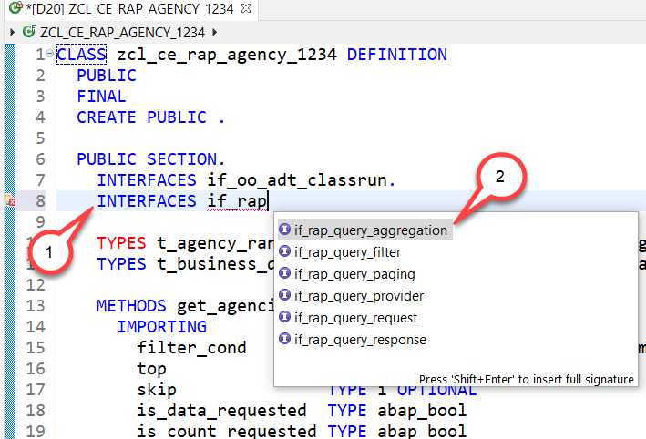
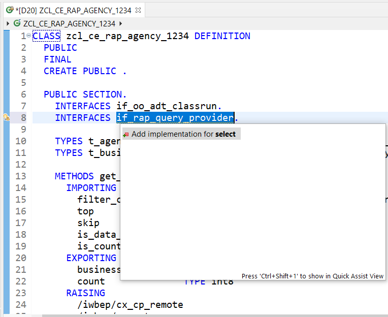

# Creating the Implementation Class

## Introduction  

In this unit we will reuse the class that we have created in Unit 1 to test the remote OData service.  

In order to be able to use our class as a query implementation class of our custom entity our class must implement the interface **if_rap_query_provider**. We will thus add this interface to it.  

The interface **if_rap_query_provider** only offers one method which is called select. 
Within this select method we will call the public method **get_agencies( )** method. 
The select method also expects that the incoming requests provide certain OData specific query parameters. 
These we will set in our coding as well.

> **Hints and Tips**    
> Speed up the typing by making use of the Code Completion feature (shortcut Ctrl+Space) and the prepared code snippets provided. 
> You can easily open an object with the shortcut *Ctrl+Shift+A*, format your source code using the Pretty Printer feature *Shift+F1* and toggle the fullscreen of the editor using the shortcut *Ctrl+M*.
>
> A great overview on ADT shortcuts can be found here: [Useful ADT Shortcuts](https://blogs.sap.com/2013/11/21/useful-keyboard-shortcuts-for-abap-in-eclipse/)
>
> Please note that the placeholder **`####`** used in object names in the exercise description must be replaced with the suffix of your choice during the exercises. The suffix can contain a maximum of 4 characters (numbers and letters).
> The screenshots in this document have been taken with the suffix `1234` and system `D20`. Your system id will be `TRL`.

> Please note that the ADT dialogs and views may change in the future due to software updates - i.e. new and/or optimized feature

Follow the instructions below.  
    
## Creating the implementation

1. Open the class **ZCL_CE_RAP_AGENCY_####** in the source code editor.

   - Expand your package  **ZRAP_TRAVEL_E_#### > Source Code Library > Classes** and double click on `ZCL_CE_RAP_AGENCY_####`

     

2. Add interface **`IF_RAP_QUERY_PROVIDER`** to the query implementation class **ZCL_CE_RAP_AGENCY_####**
 
    - Add the following statement in the public section  
      <pre>INTERFACES if_rap_query_provider. <pre>   
      
    - You can use code completion **CTRL+Space** to select the interface **`if_rap_query_provider`**.   
      
      
      
    
3. Add an implementation for the method **`if_rap_query_provider~select`**. 

    - You can use the code completion **Ctrl+Space** to add the implementation for the method **`if_rap_query_provider~select`**.
    
         
  
4. Implement the method  **`if_rap_query_provider~select`**.    
  
   Within the `select()` method we can retrieve the details of the incoming OData call using the object **`io_request`**. 

   Using the method `get_paging()` we can find out whether client side paging was requested with the incoming OData call. Using the method `get_filter()` we can retrieve the filter that was used by the incoming OData request and by calling the method `->get_as_ranges( )` provided by the filter object we can retrieve the filter as ranges. 
   
   Using the methods `is_data_requested( )` and `is_total_numb_of_rec_requested(  )` we are able to find out whether the incoming request requests that business data is returned and whether the request contains a `$count`.
   
   This comes in handy so we can provide this data when calling the method `get_agencies()`.  

    > **Please note:**  
    > If business data is requested it is mandatory to add the retrieved data via the method `set_data()` .  
    > If in addition the number of of all entries of an entity is requested the number of entities being returned must be set via the method `set_total_number_of_records()`.

    Copy and paste the coding below into the implementation of the method **`if_rap_query_provider~select`** .
   
 <pre>

   METHOD if_rap_query_provider~select.
    DATA business_data TYPE t_business_data.
    DATA(top)     = io_request->get_paging( )->get_page_size( ).
    DATA(skip)    = io_request->get_paging( )->get_offset( ).
    DATA(requested_fields)  = io_request->get_requested_elements( ).
    DATA(sort_order)    = io_request->get_sort_elements( ).
    DATA count TYPE int8.
    TRY.
        DATA(filter_condition) = io_request->get_filter( )->get_as_ranges( ).

        get_agencies(
                 EXPORTING
                   filter_cond        = filter_condition
                   top                = CONV i( top )
                   skip               = CONV i( skip )
                   is_data_requested  = io_request->is_data_requested( )
                   is_count_requested = io_request->is_total_numb_of_rec_requested(  )
                 IMPORTING
                   business_data  = business_data
                   count     = count
                 ) .

        IF io_request->is_total_numb_of_rec_requested(  ).
          io_response->set_total_number_of_records( count ).
        ENDIF.
        IF io_request->is_data_requested(  ).
          io_response->set_data( business_data ).
        ENDIF.

      CATCH cx_root INTO DATA(exception).
        DATA(exception_message) = cl_message_helper=>get_latest_t100_exception( exception )->if_message~get_longtext( ).
    ENDTRY.
  ENDMETHOD.

 </pre>
 
 5. Save  and activate your changes.

## Summary

You have implemented the query implementation class of the custom entity. As a result we can now enhance the implementation of our managed business object that we have created in exercise 2 and 3. 

We will use the custom entity

- as a value help
- within the determination of agency that is selected when creating or changing travel entities

so that you will have implemented a side-by-side extension scenario.

## Solution
Find the source code for the implementation class of our custom entity in the exercise4/sources folder:
[Sources](sources) or use the following link.

- [W5U4_CLAS_zcl_ce_rap_agency_####.txt](/exercise4/sources/W5U4_CLAS_zcl_ce_rap_agency_%23%23%23%23.txt)

Do not forget to replace all the occurrences of #### with your chosen suffix in the copied source code.

 
## Next exercise
[Exercise 4 Unit 4: Enhancing the Flight Model with External Data](unit4.md)
